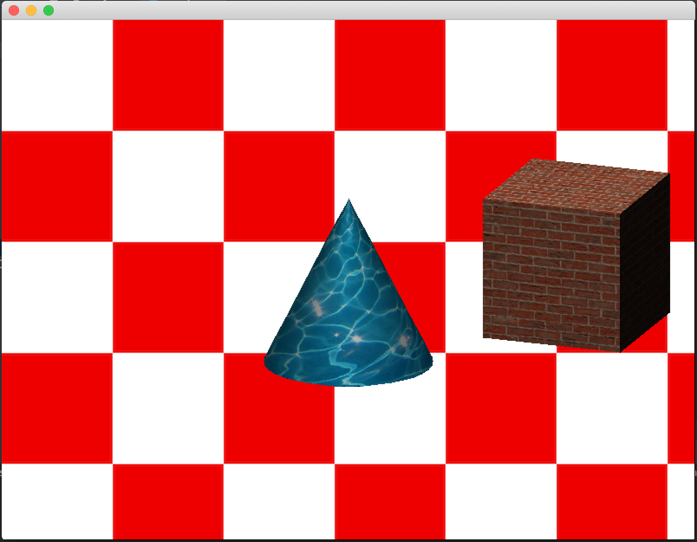

# OOGraph
A fully object object oriented 3D software renderer written in Java.

It's possible to output to a swing window or to an image, or to other surfaces implementing the Surface interface.
It can import OBJ model files or textures, and the rasterizer pipeline it's customizable via vertex and pixel shaders.

